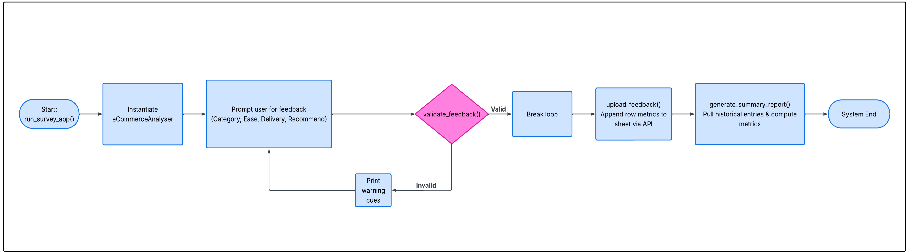

# eCommerce Feedback Analyser

eCommerce Feedback Analyser is a terminal-based Python tool that runs via the Heroku cloud application platform.

This application offers users an easy way to submit review data about their latest ecommerce transactions, tracking department metrics, usability ratings, and referral choices. The system validates entries on the fly and logs them directly to a connected Google Sheets spreadsheet.

[This is the live version of my project]([INSERT_YOUR_LIVE_HEROKU_LINK_HERE](https://ecommerce-feedback-analyser-b4d8903062a5.herokuapp.com/)

---

## How to use

The software initiates a secure connection with the cloud database immediately upon launching.

1. The user is greeted and presented with a list of store categories open for review.
2. The interface prompts the user for four specific data points: Category, Ease of Use rating (1-5), Delivery rating (1-5), and a referral confirmation (Yes/No).

3. The program filters and checks each input. If a mistake is found, an error message is printed and the user must try again.

4. Once all responses pass validation, they are transmitted directly to the online spreadsheet.
5. A statistics overview is instantly compiled, pulling previous database entries to showcase live business performance metrics.

   

---

## Features

### Existing Features

- **Console-Based Data Collection**
  - Displays a clean, readable text interface with direct instructions.
  - Systematically captures specific performance points from the user.

- **Failsafe Input Screening**
  - Rejects categories that do not exist in the store system.
  - Mandates that numerical ratings fall strictly between 1 and 5.
  - Restricts recommendation text exclusively to 'Yes' or 'No' selections.
  - Catches `ValueErrors` seamlessly to keep text strings from breaking numeric inputs.

- **Live Spreadsheet Data Synchronization**
  - Utilizes Python oauth2 credentials to create a secure database bridge.
  - Automatically appends new entry data as clean rows in the cloud.

- **Dynamic Historical Metrics**
  - Scans all previous customer entries stored in the database document.
  - Accurately computes running tally counts and arithmetic mean scores.

### Future Features

- Implement user login profiles to separate admin views from customer views.

---

## Data Model

I chose an object-oriented design for this application by building an `eCommerceAnalyser` class as the core structural blueprint.

The program creates an instance of this analyzer to store application rules (like accepted retail categories), maintain the cloud worksheet link, and provide specific methods to process user entries and display statistics.

Key methods inside the class include:

- `get_user_feedback`: Collects raw string inputs from the terminal window.
- `validate_feedback`: Screens entries to isolate and reject empty or incorrect formatting.
- `upload_feedback`: Handles external cloud API requests to append rows to the sheet.
- `generate_summary_report`: Loops through historical rows to aggregate scores and display results.

---

## Testing

I conducted complete manual testing across the codebase to ensure system stability:

| Feature / Element Tested | Input Given                                                                          | Expected Outcome                                              | Actual Outcome                             | Status   |
| :----------------------- | :----------------------------------------------------------------------------------- | :------------------------------------------------------------ | :----------------------------------------- | :------- |
| Code Formatting          | Ran script through PEP8 linter                                                       | Clean formatting with no syntax errors                        | Returned no style warning or errors        | **PASS** |
| Input Validation         | Intentionally entered bad inouts (out-of-range integers, random words, blank spaces) | System rejects inputs and validation loops successfully reset | Caught invalid data and re-prompted safely | **PASS** |
| Core Analytics           | Cross-checked terminal analytics against live spreadsheet entries                    | Calculations match the raw data perfectly                     | Math output is completely accurate         | **PASS** |

### Bugs

#### Solved Bugs

- Resolved an error where data uploads crashed because the database connection object wasn't initialized early enough in the main execution routine.
- Fixed a math calculation crash caused by parsing raw strings from the database by wrapping column variables in explicit integer (`int()`) conversions.

#### Remaining Bugs

- No remaining bugs found.

### Validator Testing

- PEP8: The codebase returned no style warnings or syntax errors when analyzed.

---

## Deployment

This app was deployed using the Code Institute mock console framework on Heroku.

- Deployment Protocol:
  - Clone or fork this project repository using your GitHub account.
  - Create a brand new app via your Heroku dashboard.
  - Configure the app environment buildpacks to `Python` and `NodeJS` (keeping Python on top).
  - Connect your Heroku application directly to your active GitHub repository branch.
  - Under Config Vars, create a key named `CREDS` and paste the entire text contents of your local `creds.json` file into it.
  - Add a second Config Var named `PORT` and give it a value of `8000`.
  - Select **Deploy Branch** to launch the live app.

---

## Credits

- Code Institute for the terminal emulator workspace template and underlying lesson curriculum.
- The gspread project documentation for guidelines on extracting sheet records as lists of dictionaries.
